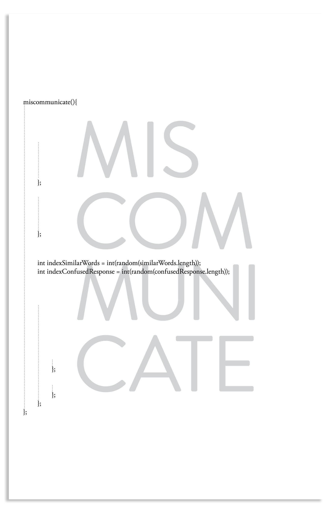

# Miscommunicate
instructions on miscommunication between me and my parents 
...

###What usually happens is:

1. I will ask a question.

2. They will try to answer my question.

3. But all I will hear are words similar to their answer, not the answer itself.

###Proceeding onwards:

1. I will guess an array of words which sound similar to the sound I hear.
2. They will just continue to repeat the same answer. 
3. Step 1 (Guessing) & Step 2 (Repeating) will repeat indefinitely.

###Finally:

1. I will guess correctly.

2. Or not at all.

